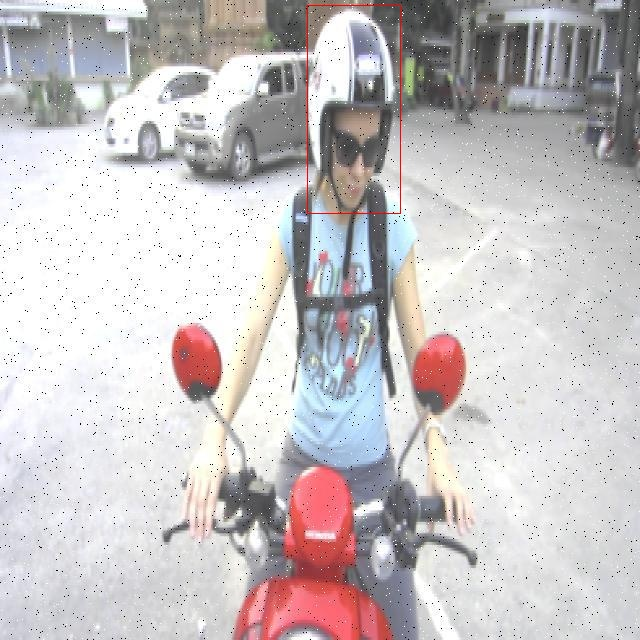

# 摩托车骑行行为检测检测系统源码分享
 # [一条龙教学YOLOV8标注好的数据集一键训练_70+全套改进创新点发刊_Web前端展示]

### 1.研究背景与意义

项目参考[AAAI Association for the Advancement of Artificial Intelligence](https://gitee.com/qunmasj/projects)

项目来源[AACV Association for the Advancement of Computer Vision](https://kdocs.cn/l/cszuIiCKVNis)

研究背景与意义

随着城市化进程的加快，摩托车作为一种便捷的交通工具，越来越受到人们的青睐。然而，摩托车骑行行为的安全性问题也日益凸显，尤其是在骑行者佩戴安全头盔的情况、车辆牌照的清晰度以及骑行姿势的规范性等方面。根据相关统计数据，未佩戴头盔的摩托车骑行者在交通事故中受伤的风险显著增加，这不仅对骑行者自身的安全构成威胁，也对其他交通参与者的安全造成潜在风险。因此，开发一种高效的摩托车骑行行为检测系统，能够实时监测骑行者的行为并提供相应的安全提示，具有重要的社会意义和实际应用价值。

在这一背景下，基于改进YOLOv8的摩托车骑行行为检测系统应运而生。YOLO（You Only Look Once）系列模型以其高效的实时目标检测能力和较高的准确率而广泛应用于各种计算机视觉任务。YOLOv8作为该系列的最新版本，进一步提升了模型的检测精度和速度，尤其适合在复杂的交通环境中进行摩托车骑行行为的实时监测。通过对YOLOv8的改进，结合摩托车骑行行为的特征，我们可以有效地识别出骑行者是否佩戴头盔、车辆牌照的清晰度以及骑行姿势是否规范等关键行为。

本研究所使用的数据集包含2500张图像，涵盖了三类骑行行为：未佩戴头盔、车辆牌照以及超人姿势。这些类别的选择不仅反映了摩托车骑行中的安全隐患，也为系统的训练和测试提供了丰富的样本数据。通过对这些图像的分析和处理，系统能够在多种环境下实现对骑行者行为的准确识别，进而为交通管理部门提供数据支持，帮助制定更为科学的交通安全政策。

此外，摩托车骑行行为检测系统的开发还有助于推动智能交通系统的发展。随着人工智能技术的不断进步，基于视觉识别的智能监控系统在交通管理中的应用前景广阔。通过实时监测和分析骑行者的行为，系统不仅能够及时发现安全隐患，还可以为骑行者提供个性化的安全提示，从而提高其安全意识，减少交通事故的发生。

综上所述，基于改进YOLOv8的摩托车骑行行为检测系统的研究，不仅在技术上具有创新性，也在社会实践中具有重要的意义。通过提升摩托车骑行行为的检测能力，我们可以为构建更加安全的交通环境贡献力量，推动社会的可持续发展。未来，随着数据集的不断丰富和模型的进一步优化，该系统有望在更广泛的场景中应用，为交通安全管理提供更为有效的解决方案。

### 2.图片演示


##### 注意：由于此博客编辑较早，上面“2.图片演示”和“3.视频演示”展示的系统图片或者视频可能为老版本，新版本在老版本的基础上升级如下：（实际效果以升级的新版本为准）

  （1）适配了YOLOV8的“目标检测”模型和“实例分割”模型，通过加载相应的权重（.pt）文件即可自适应加载模型。

  （2）支持“图片识别”、“视频识别”、“摄像头实时识别”三种识别模式。

  （3）支持“图片识别”、“视频识别”、“摄像头实时识别”三种识别结果保存导出，解决手动导出（容易卡顿出现爆内存）存在的问题，识别完自动保存结果并导出到tempDir中。

  （4）支持Web前端系统中的标题、背景图等自定义修改，后面提供修改教程。

  另外本项目提供训练的数据集和训练教程,暂不提供权重文件（best.pt）,需要您按照教程进行训练后实现图片演示和Web前端界面演示的效果。

### 3.视频演示

[3.1 视频演示](https://www.bilibili.com/video/BV1iNtBewEDS/)

### 4.数据集信息展示

##### 4.1 本项目数据集详细数据（类别数＆类别名）

nc: 3
names: ['Without Helmet', 'plate', 'superman']


##### 4.2 本项目数据集信息介绍

数据集信息展示

在本研究中，我们使用的数据集名为“motorcyclist behaviours detection”，该数据集专门用于训练和改进YOLOv8模型，以实现对摩托车骑行行为的精准检测。随着摩托车在城市交通中扮演着越来越重要的角色，摩托车骑行者的安全问题日益突出，因此，开发一个高效的检测系统以识别骑行者的行为，尤其是与安全相关的行为，显得尤为重要。

该数据集包含三种主要类别，分别是“Without Helmet”（未佩戴头盔）、“plate”（车牌）和“superman”（骑行者以“超人”姿势骑行）。这三种类别的选择反映了摩托车骑行行为中的关键安全隐患和特征。首先，“Without Helmet”类别旨在识别那些未佩戴安全头盔的骑行者，这一行为直接关系到骑行者的安全，未佩戴头盔的骑行者在发生意外时面临更高的受伤风险。通过对这一行为的检测，相关部门可以采取措施提高骑行者的安全意识，并促进交通安全教育。

其次，“plate”类别关注的是摩托车的车牌识别。这一功能不仅有助于交通管理部门追踪和监控摩托车的使用情况，还能在发生交通违法行为时提供必要的证据支持。车牌的自动识别对于构建智能交通系统至关重要，能够有效提高交通管理的效率和准确性。

最后，“superman”类别则是对骑行者在骑行过程中采取特定姿势的检测。这种姿势通常被认为是不安全的骑行方式，可能会导致事故的发生。通过识别这一行为，系统能够及时发出警告，提醒骑行者注意骑行安全，从而减少事故的发生率。

该数据集的构建过程严格遵循数据采集和标注的标准，确保了数据的准确性和可靠性。数据集中的图像涵盖了多种环境和光照条件，以增强模型的鲁棒性和适应性。每个类别的样本数量经过精心设计，以确保模型在训练过程中能够获得足够的学习信息，从而提高其在实际应用中的表现。

通过对“motorcyclist behaviours detection”数据集的深入分析和应用，我们期望能够显著提升YOLOv8在摩托车骑行行为检测中的性能。这不仅将为摩托车骑行者的安全提供有力保障，也为交通管理部门提供更为有效的工具，以应对日益复杂的城市交通环境。未来，我们希望该系统能够广泛应用于智能交通监控、事故预防和交通安全教育等多个领域，为构建安全、和谐的交通环境贡献力量。





### 5.全套项目环境部署视频教程（零基础手把手教学）

[5.1 环境部署教程链接（零基础手把手教学）](https://www.ixigua.com/7404473917358506534?logTag=c807d0cbc21c0ef59de5)


[5.2 安装Python虚拟环境创建和依赖库安装视频教程链接（零基础手把手教学）](https://www.ixigua.com/7404474678003106304?logTag=1f1041108cd1f708b01a)

### 6.手把手YOLOV8训练视频教程（零基础小白有手就能学会）

[6.1 手把手YOLOV8训练视频教程（零基础小白有手就能学会）](https://www.ixigua.com/7404477157818401292?logTag=d31a2dfd1983c9668658)

### 7.70+种全套YOLOV8创新点代码加载调参视频教程（一键加载写好的改进模型的配置文件）

[7.1 70+种全套YOLOV8创新点代码加载调参视频教程（一键加载写好的改进模型的配置文件）](https://www.ixigua.com/7404478314661806627?logTag=29066f8288e3f4eea3a4)

### 8.70+种全套YOLOV8创新点原理讲解（非科班也可以轻松写刊发刊，V10版本正在科研待更新）

由于篇幅限制，每个创新点的具体原理讲解就不一一展开，具体见下列网址中的创新点对应子项目的技术原理博客网址【Blog】：


[8.1 70+种全套YOLOV8创新点原理讲解链接](https://gitee.com/qunmasj/good)

### 9.系统功能展示（检测对象为举例，实际内容以本项目数据集为准）

图9.1.系统支持检测结果表格显示

  图9.2.系统支持置信度和IOU阈值手动调节

  图9.3.系统支持自定义加载权重文件best.pt(需要你通过步骤5中训练获得)

  图9.4.系统支持摄像头实时识别

  图9.5.系统支持图片识别

  图9.6.系统支持视频识别

  图9.7.系统支持识别结果文件自动保存

  图9.8.系统支持Excel导出检测结果数据


### 10.原始YOLOV8算法原理

原始YOLOv8算法原理

YOLOv8算法是由Ultralytics公司于2023年1月10日发布的目标检测模型，作为YOLO系列的最新版本，它在YOLOv7的基础上进行了多方面的优化和改进。YOLOv8的核心理念依然是通过深度学习技术实现高效的目标检测，其主要特征在于将整个图像作为输入，直接在图像上进行目标检测和定位，而不再依赖传统的滑动窗口或区域提议方法。这种端到端的处理方式不仅提升了检测的精度，还显著提高了处理速度，使得YOLOv8在实时应用场景中表现出色。

在网络结构方面，YOLOv8采用了更深的卷积神经网络（CNN），其架构主要由输入端、主干网络和检测端三部分组成。输入端负责接收原始图像，主干网络则通过特征提取来捕捉图像中的重要信息，而检测端则负责将提取到的特征转化为具体的目标检测结果。YOLOv8在主干网络中引入了CSPDarknet结构，这种结构通过将网络分为多个部分并结合多个残差块，增强了特征提取的能力。此外，YOLOv8还在特征提取过程中采用了C2f模块替代了前代模型中的C3模块。C2f模块的设计灵感来源于YOLOv5和YOLOv7中的创新元素，它通过将输入特征图分为两个分支并进行降维处理，从而有效地增加了梯度流的信息，使得模型在保持轻量化的同时，能够获得更丰富的特征表示。

YOLOv8在检测端的设计上也进行了重要的创新。与传统的Anchor-Based方法不同，YOLOv8采用了Anchor-Free的检测方式，直接预测目标的中心点和宽高比例。这种方法不仅减少了对Anchor框的依赖，还显著提高了检测的速度和准确度。此外，YOLOv8在Head部分使用了流行的解耦合头结构，将分类和检测任务分离，进一步提升了模型的灵活性和性能。

为了增强模型的训练效果，YOLOv8引入了多尺度训练和测试的策略，使得模型能够在不同的尺度下进行有效的特征学习。这一策略结合了特征金字塔网络（FPN）和路径聚合网络（PAN）的优势，能够有效处理不同尺寸的目标，确保在各种场景下都能实现高效的目标检测。同时，YOLOv8在数据增强方面也进行了优化，采用了动态的Task-Aligned Assigner样本分配策略，提升了训练的稳定性和准确性。

在损失计算方面，YOLOv8使用了BCELoss作为分类损失，DFLLoss和CIoULoss作为回归损失。这种多损失函数的设计，使得模型在训练过程中能够更好地平衡分类和定位的精度，从而提高整体的检测性能。

值得一提的是，YOLOv8的不同模型版本（如YOLOv8n、YOLOv8s、YOLOv8m、YOLOv8l和YOLOv8x）为不同的应用场景提供了灵活的选择。每个版本在深度、特征图宽度和参数量上有所不同，用户可以根据具体需求选择合适的模型。这种基于缩放系数的设计不仅使得YOLOv8能够适应各种硬件环境，还能在保证性能的前提下，实现更高的计算效率。

YOLOv8的应用场景非常广泛，包括智能监控、自动驾驶、人脸识别等多个领域。其高效的检测能力和实时处理能力，使得它在实际应用中展现出极大的潜力。例如，在智能监控系统中，YOLOv8能够实时识别并跟踪多个目标，提升安全性和监控效率；在自动驾驶领域，YOLOv8能够快速识别周围环境中的行人、车辆和交通标志，为自动驾驶决策提供重要支持。

综上所述，YOLOv8算法通过深度卷积神经网络的优化、创新的模块设计、灵活的模型选择以及高效的训练策略，显著提升了目标检测的精度和速度。作为YOLO系列的最新版本，YOLOv8不仅继承了前代模型的优点，还在多个方面进行了创新和改进，使其在各种应用场景中都能发挥出色的性能。随着YOLOv8的不断发展和应用，目标检测技术将迎来更广阔的前景。


### 11.项目核心源码讲解（再也不用担心看不懂代码逻辑）

#### 11.1 ui.py

以下是代码的核心部分，并附上详细的中文注释：

```python
import sys
import subprocess

def run_script(script_path):
    """
    使用当前 Python 环境运行指定的脚本。

    Args:
        script_path (str): 要运行的脚本路径

    Returns:
        None
    """
    # 获取当前 Python 解释器的路径
    python_path = sys.executable

    # 构建运行命令，使用 streamlit 运行指定的脚本
    command = f'"{python_path}" -m streamlit run "{script_path}"'

    # 执行命令
    result = subprocess.run(command, shell=True)
    # 检查命令执行的返回码，0 表示成功，非0表示出错
    if result.returncode != 0:
        print("脚本运行出错。")

# 实例化并运行应用
if __name__ == "__main__":
    # 指定要运行的脚本路径
    script_path = "web.py"  # 假设脚本在当前目录下

    # 调用函数运行脚本
    run_script(script_path)
```

### 代码核心部分分析：

1. **导入模块**：
   - `sys`：用于访问与 Python 解释器相关的变量和函数。
   - `subprocess`：用于创建新进程、连接到它们的输入/输出/错误管道，并获得返回码。

2. **`run_script` 函数**：
   - 该函数接收一个脚本路径作为参数，并使用当前 Python 环境运行该脚本。
   - `sys.executable` 获取当前 Python 解释器的路径。
   - 使用 `subprocess.run` 执行构建的命令，并检查返回码以确定脚本是否成功运行。

3. **主程序块**：
   - 在 `if __name__ == "__main__":` 块中，指定要运行的脚本路径，并调用 `run_script` 函数来执行该脚本。

### 重要性：
- 该代码片段的核心功能是通过 Python 环境运行指定的脚本，适用于需要动态执行 Python 脚本的场景，尤其是在使用 `streamlit` 进行 Web 应用开发时。

这个程序文件名为 `ui.py`，它的主要功能是运行一个指定的 Python 脚本，具体来说是使用 Streamlit 框架来启动一个 Web 应用。

首先，文件中导入了一些必要的模块，包括 `sys`、`os` 和 `subprocess`。其中，`sys` 模块用于访问与 Python 解释器相关的变量和函数，`os` 模块提供了与操作系统交互的功能，而 `subprocess` 模块则用于执行外部命令。

接下来，文件中定义了一个名为 `run_script` 的函数，该函数接受一个参数 `script_path`，表示要运行的脚本的路径。在函数内部，首先通过 `sys.executable` 获取当前 Python 解释器的路径。然后，构建一个命令字符串，使用该 Python 解释器和 Streamlit 模块来运行指定的脚本。命令的格式是 `"{python_path}" -m streamlit run "{script_path}"`，这将调用 Streamlit 来启动 Web 应用。

接着，使用 `subprocess.run` 方法执行构建好的命令。如果命令执行后返回的状态码不为 0，表示脚本运行出错，此时会打印出一条错误信息。

在文件的最后部分，使用 `if __name__ == "__main__":` 语句来确保当该文件作为主程序运行时才会执行后面的代码。在这个代码块中，首先调用 `abs_path` 函数获取 `web.py` 脚本的绝对路径，并将其赋值给 `script_path` 变量。然后，调用 `run_script` 函数，传入 `script_path`，以启动指定的 Web 应用。

总的来说，这个程序的作用是提供一个简单的接口，通过命令行运行一个 Streamlit Web 应用，方便用户在本地环境中启动和测试 Web 应用。

#### 11.2 code\ultralytics\models\yolo\obb\val.py

以下是代码中最核心的部分，并附上详细的中文注释：

```python
from ultralytics.models.yolo.detect import DetectionValidator
from ultralytics.utils import ops
from ultralytics.utils.metrics import OBBMetrics, batch_probiou
from ultralytics.utils.plotting import output_to_rotated_target, plot_images

class OBBValidator(DetectionValidator):
    """
    OBBValidator类扩展了DetectionValidator类，用于基于定向边界框（OBB）模型的验证。
    """

    def __init__(self, dataloader=None, save_dir=None, pbar=None, args=None, _callbacks=None):
        """初始化OBBValidator并将任务设置为'obb'，指标设置为OBBMetrics。"""
        super().__init__(dataloader, save_dir, pbar, args, _callbacks)
        self.args.task = "obb"  # 设置任务类型为OBB
        self.metrics = OBBMetrics(save_dir=self.save_dir, plot=True, on_plot=self.on_plot)  # 初始化OBB指标

    def postprocess(self, preds):
        """对预测输出应用非极大值抑制（NMS）。"""
        return ops.non_max_suppression(
            preds,
            self.args.conf,  # 置信度阈值
            self.args.iou,   # IOU阈值
            labels=self.lb,
            nc=self.nc,
            multi_label=True,
            agnostic=self.args.single_cls,
            max_det=self.args.max_det,
            rotated=True,  # 处理旋转框
        )

    def _process_batch(self, detections, gt_bboxes, gt_cls):
        """
        返回正确的预测矩阵。

        参数:
            detections (torch.Tensor): 形状为[N, 6]的张量，表示检测结果。
            gt_bboxes (torch.Tensor): 真实边界框。
            gt_cls (torch.Tensor): 真实类别。

        返回:
            (torch.Tensor): 形状为[N, 10]的正确预测矩阵，表示10个IOU水平的结果。
        """
        iou = batch_probiou(gt_bboxes, torch.cat([detections[:, :4], detections[:, -1:]], dim=-1))  # 计算IOU
        return self.match_predictions(detections[:, 5], gt_cls, iou)  # 匹配预测与真实标签

    def plot_predictions(self, batch, preds, ni):
        """在输入图像上绘制预测的边界框并保存结果。"""
        plot_images(
            batch["img"],  # 输入图像
            *output_to_rotated_target(preds, max_det=self.args.max_det),  # 处理后的预测结果
            paths=batch["im_file"],  # 图像文件路径
            fname=self.save_dir / f"val_batch{ni}_pred.jpg",  # 保存文件名
            names=self.names,  # 类别名称
            on_plot=self.on_plot,
        )  # 绘制预测结果

    def eval_json(self, stats):
        """评估YOLO输出的JSON格式并返回性能统计信息。"""
        if self.args.save_json and self.is_dota and len(self.jdict):
            import json
            from collections import defaultdict

            pred_json = self.save_dir / "predictions.json"  # 预测结果JSON文件
            pred_txt = self.save_dir / "predictions_txt"  # 预测结果TXT文件
            pred_txt.mkdir(parents=True, exist_ok=True)  # 创建目录
            data = json.load(open(pred_json))  # 加载JSON数据

            # 保存分割结果
            for d in data:
                image_id = d["image_id"]
                score = d["score"]
                classname = self.names[d["category_id"]].replace(" ", "-")
                p = d["poly"]

                with open(f'{pred_txt / f"Task1_{classname}"}.txt', "a") as f:
                    f.writelines(f"{image_id} {score} {p[0]} {p[1]} {p[2]} {p[3]} {p[4]} {p[5]} {p[6]} {p[7]}\n")

        return stats  # 返回统计信息
```

### 代码核心部分说明：
1. **OBBValidator类**：这是一个用于验证基于定向边界框（OBB）模型的类，继承自`DetectionValidator`。
2. **初始化方法**：设置任务类型为OBB，并初始化相关的性能指标。
3. **后处理方法**：对模型的预测结果应用非极大值抑制（NMS），以减少冗余的检测框。
4. **批处理方法**：计算IOU并匹配预测结果与真实标签，返回正确的预测矩阵。
5. **绘制预测结果**：将预测的边界框绘制在输入图像上并保存结果。
6. **评估JSON输出**：将预测结果保存为JSON格式，并返回性能统计信息。

这个程序文件是Ultralytics YOLO模型的一个验证器类，专门用于基于定向边界框（OBB）模型的验证。该类继承自DetectionValidator，主要用于处理和评估YOLO模型在特定数据集上的性能。

在初始化时，OBBValidator类会设置任务类型为“obb”，并初始化用于评估的指标（OBBMetrics）。这些指标会在验证过程中被用来评估模型的性能。init_metrics方法用于初始化评估指标，并检查数据集是否为DOTA格式。

postprocess方法实现了非极大值抑制（NMS），用于处理模型的预测输出，以减少重叠的检测框。_process_batch方法则用于处理每个批次的检测结果和真实标签，计算交并比（IoU），并返回正确的预测矩阵。

_prepare_batch和_prepare_pred方法分别用于准备输入批次和预测批次，确保边界框在验证过程中得到正确的缩放和填充。plot_predictions方法用于将预测的边界框绘制在输入图像上，并保存结果。

pred_to_json方法将YOLO的预测结果序列化为COCO格式的JSON文件，方便后续处理和评估。save_one_txt方法则将YOLO的检测结果保存为特定格式的文本文件，包含归一化坐标。

eval_json方法用于评估YOLO输出的JSON格式，并返回性能统计信息。如果设置了保存JSON的选项，并且数据集为DOTA格式，程序会将预测结果保存为DOTA格式的文本文件，并合并结果。合并的结果可能会稍微降低mAP，因为它使用了不同的IoU计算方法。

整体来看，这个文件的功能是提供一个全面的验证工具，用于评估YOLO模型在特定任务上的表现，尤其是在处理定向边界框时。通过一系列方法，该类能够有效地处理数据、进行预测、绘制结果并保存评估统计信息。

#### 11.3 code\ultralytics\models\sam\modules\encoders.py

以下是代码中最核心的部分，并附上详细的中文注释：

```python
import torch
import torch.nn as nn
import torch.nn.functional as F

class ImageEncoderViT(nn.Module):
    """
    使用视觉变换器（ViT）架构的图像编码器，将图像编码为紧凑的潜在空间。
    编码器将图像拆分为补丁，并通过一系列变换块处理这些补丁。
    编码后的补丁通过一个颈部模块生成最终的编码表示。
    """

    def __init__(self, img_size: int = 1024, patch_size: int = 16, in_chans: int = 3, embed_dim: int = 768, depth: int = 12, num_heads: int = 12):
        """
        初始化图像编码器的参数。

        Args:
            img_size (int): 输入图像的大小，假设为正方形。
            patch_size (int): 每个补丁的大小。
            in_chans (int): 输入图像的通道数。
            embed_dim (int): 补丁嵌入的维度。
            depth (int): ViT的深度（变换块的数量）。
            num_heads (int): 每个ViT块中的注意力头数。
        """
        super().__init__()
        self.img_size = img_size

        # 初始化补丁嵌入模块
        self.patch_embed = PatchEmbed(
            kernel_size=(patch_size, patch_size),
            stride=(patch_size, patch_size),
            in_chans=in_chans,
            embed_dim=embed_dim,
        )

        # 初始化位置嵌入
        self.pos_embed = nn.Parameter(torch.zeros(1, img_size // patch_size, img_size // patch_size, embed_dim))

        # 初始化变换块
        self.blocks = nn.ModuleList()
        for i in range(depth):
            block = Block(
                dim=embed_dim,
                num_heads=num_heads,
            )
            self.blocks.append(block)

        # 初始化颈部模块
        self.neck = nn.Sequential(
            nn.Conv2d(embed_dim, 256, kernel_size=1, bias=False),
            nn.LayerNorm(256),
            nn.Conv2d(256, 256, kernel_size=3, padding=1, bias=False),
            nn.LayerNorm(256),
        )

    def forward(self, x: torch.Tensor) -> torch.Tensor:
        """处理输入，通过补丁嵌入、位置嵌入、变换块和颈部模块。"""
        x = self.patch_embed(x)  # 将输入图像拆分为补丁并嵌入
        x = x + self.pos_embed  # 添加位置嵌入
        for blk in self.blocks:  # 通过每个变换块
            x = blk(x)
        return self.neck(x.permute(0, 3, 1, 2))  # 通过颈部模块并调整维度


class Block(nn.Module):
    """支持窗口注意力和残差传播的变换块。"""

    def __init__(self, dim: int, num_heads: int):
        """
        初始化变换块的参数。

        Args:
            dim (int): 输入通道数。
            num_heads (int): 注意力头数。
        """
        super().__init__()
        self.norm1 = nn.LayerNorm(dim)  # 归一化层
        self.attn = Attention(dim, num_heads=num_heads)  # 注意力模块
        self.norm2 = nn.LayerNorm(dim)  # 归一化层
        self.mlp = MLPBlock(embedding_dim=dim)  # MLP模块

    def forward(self, x: torch.Tensor) -> torch.Tensor:
        """执行变换块的前向传播。"""
        shortcut = x  # 保存输入以进行残差连接
        x = self.norm1(x)  # 归一化
        x = self.attn(x)  # 应用注意力机制
        x = shortcut + x  # 残差连接
        return x + self.mlp(self.norm2(x))  # 添加MLP的输出


class Attention(nn.Module):
    """多头注意力模块，支持相对位置嵌入。"""

    def __init__(self, dim: int, num_heads: int):
        """
        初始化注意力模块的参数。

        Args:
            dim (int): 输入通道数。
            num_heads (int): 注意力头数。
        """
        super().__init__()
        self.num_heads = num_heads
        head_dim = dim // num_heads  # 每个头的维度
        self.scale = head_dim**-0.5  # 缩放因子

        self.qkv = nn.Linear(dim, dim * 3)  # 查询、键、值的线性变换
        self.proj = nn.Linear(dim, dim)  # 输出投影

    def forward(self, x: torch.Tensor) -> torch.Tensor:
        """应用前向操作，包括注意力计算。"""
        B, H, W, _ = x.shape  # 获取输入的形状
        qkv = self.qkv(x).reshape(B, H * W, 3, self.num_heads, -1).permute(2, 0, 3, 1, 4)  # 计算qkv
        q, k, v = qkv.reshape(3, B * self.num_heads, H * W, -1).unbind(0)  # 分离q、k、v

        attn = (q * self.scale) @ k.transpose(-2, -1)  # 计算注意力权重
        attn = attn.softmax(dim=-1)  # 应用softmax
        x = (attn @ v).view(B, self.num_heads, H, W, -1).permute(0, 2, 3, 1, 4).reshape(B, H, W, -1)  # 计算输出
        return self.proj(x)  # 投影输出


class PatchEmbed(nn.Module):
    """图像到补丁嵌入的模块。"""

    def __init__(self, kernel_size: Tuple[int, int] = (16, 16), in_chans: int = 3, embed_dim: int = 768):
        """
        初始化补丁嵌入模块。

        Args:
            kernel_size (Tuple): 投影层的卷积核大小。
            in_chans (int): 输入图像的通道数。
            embed_dim (int): 补丁嵌入的维度。
        """
        super().__init__()
        self.proj = nn.Conv2d(in_chans, embed_dim, kernel_size=kernel_size)  # 卷积层用于补丁嵌入

    def forward(self, x: torch.Tensor) -> torch.Tensor:
        """通过卷积计算补丁嵌入并调整维度。"""
        return self.proj(x).permute(0, 2, 3, 1)  # B C H W -> B H W C
```

### 代码说明：
1. **ImageEncoderViT**：该类实现了一个图像编码器，使用ViT架构将输入图像编码为潜在空间。它包括补丁嵌入、位置嵌入、多个变换块和一个颈部模块。
2. **Block**：实现了变换块，包含注意力机制和MLP（多层感知机）模块，支持残差连接。
3. **Attention**：实现了多头注意力机制，计算查询、键、值之间的关系，并生成注意力输出。
4. **PatchEmbed**：负责将输入图像拆分为补丁并进行嵌入，使用卷积层实现。

这些部分是构建视觉变换器模型的核心，能够处理图像数据并提取特征。

这个程序文件定义了一个用于图像编码的模块，主要基于视觉变换器（Vision Transformer, ViT）架构。它的主要功能是将输入图像编码为一个紧凑的潜在空间表示。程序中包含了多个类，每个类负责不同的功能。

首先，`ImageEncoderViT`类是主要的图像编码器。它的构造函数接收多个参数，包括输入图像的大小、补丁大小、输入通道数、嵌入维度、深度、注意力头的数量等。这个类的核心功能是将输入图像分割成多个补丁，并通过一系列的变换块（transformer blocks）对这些补丁进行处理。编码后的补丁再通过一个“颈部”模块（neck）进一步处理，以生成最终的编码表示。

在初始化过程中，首先创建了一个补丁嵌入模块（`PatchEmbed`），该模块通过卷积操作将图像转换为补丁嵌入。接着，如果启用了绝对位置嵌入，程序会初始化一个位置嵌入参数。然后，程序根据指定的深度创建多个变换块，并将它们存储在一个模块列表中。最后，构建了一个颈部模块，包含几个卷积层和层归一化操作。

`forward`方法是该类的前向传播函数，输入图像经过补丁嵌入后，如果存在位置嵌入，则将其加到嵌入上。接着，嵌入通过所有的变换块进行处理，最后通过颈部模块生成输出。

接下来是`PromptEncoder`类，它负责编码不同类型的提示，包括点、框和掩码，以便输入到掩码解码器中。该类的构造函数接收嵌入维度、输入图像大小、掩码通道数等参数。它创建了用于随机位置嵌入的模块，并定义了多个嵌入层，用于处理不同类型的点和掩码。

`forward`方法实现了对不同类型提示的编码，返回稀疏和密集的嵌入。该方法首先获取批次大小，然后根据输入的点、框和掩码调用相应的嵌入函数，最后返回生成的嵌入。

`PositionEmbeddingRandom`类用于生成基于随机空间频率的位置信息编码。它的构造函数初始化了一个高斯矩阵，用于生成位置编码。`forward`方法生成指定大小的网格的位置信息编码。

`Block`类定义了变换块的结构，包含归一化层、注意力层和多层感知机（MLP）模块。它的前向传播方法实现了对输入的处理，包括残差连接和窗口注意力的支持。

`Attention`类实现了多头注意力机制，支持相对位置嵌入。它的前向传播方法计算查询、键和值的注意力权重，并应用于输入。

此外，程序还定义了一些辅助函数，如`window_partition`和`window_unpartition`，用于将输入张量划分为窗口和恢复原始形状。

最后，`PatchEmbed`类负责将图像转换为补丁嵌入，使用卷积操作实现。其前向传播方法将输入张量进行卷积处理并调整维度。

整体来看，这个程序文件实现了一个复杂的图像编码器，结合了视觉变换器的架构，能够有效地处理图像数据并生成相应的编码表示。

#### 11.4 code\ultralytics\models\__init__.py

以下是保留的核心代码部分，并附上详细的中文注释：

```python
# 导入所需的模块
from .rtdetr import RTDETR  # 导入RTDETR类
from .sam import SAM        # 导入SAM类
from .yolo import YOLO      # 导入YOLO类

# 定义可以被外部导入的模块列表
__all__ = "YOLO", "RTDETR", "SAM"  # 允许更简单的导入方式
```

### 代码注释说明：

1. **模块导入**：
   - `from .rtdetr import RTDETR`：从当前包的`rtdetr`模块中导入`RTDETR`类，可能用于目标检测或其他相关任务。
   - `from .sam import SAM`：从当前包的`sam`模块中导入`SAM`类，具体功能依赖于该模块的实现。
   - `from .yolo import YOLO`：从当前包的`yolo`模块中导入`YOLO`类，YOLO是一种流行的实时目标检测算法。

2. **`__all__`变量**：
   - `__all__ = "YOLO", "RTDETR", "SAM"`：定义了一个特殊变量`__all__`，用于控制当使用`from module import *`语句时，哪些名称会被导入。这里指定了`YOLO`、`RTDETR`和`SAM`这三个类可以被外部访问，简化了导入过程。

这个程序文件是一个Python模块的初始化文件，文件名为`__init__.py`，它位于`code/ultralytics/models/`目录下。该文件的主要功能是定义模块的公共接口以及导入相关的类或函数。

首先，文件开头的注释部分提到这是与Ultralytics YOLO相关的代码，并且遵循AGPL-3.0许可证。这表明该代码是与目标检测相关的，并且是开源的，用户在使用时需要遵循相应的许可证条款。

接下来，文件通过`from`语句导入了三个类：`RTDETR`、`SAM`和`YOLO`。这些类可能分别实现了不同的目标检测算法或模型，具体功能可以在各自的模块文件中找到。

最后，`__all__`变量被定义为一个元组，包含了字符串"YOLO"、"RTDETR"和"SAM"。这个变量的作用是指定当使用`from module import *`语句时，哪些名称是可以被导入的。这是一种控制模块导出接口的方式，能够简化导入操作，避免不必要的名称污染。

总的来说，这个文件的作用是组织和管理Ultralytics YOLO模型相关的类，使得用户可以方便地导入和使用这些模型。

#### 11.5 train.py

以下是代码中最核心的部分，并附上详细的中文注释：

```python
class DetectionTrainer(BaseTrainer):
    """
    DetectionTrainer类扩展了BaseTrainer类，用于基于检测模型的训练。
    """

    def build_dataset(self, img_path, mode="train", batch=None):
        """
        构建YOLO数据集。

        参数:
            img_path (str): 包含图像的文件夹路径。
            mode (str): 模式，可以是'train'或'val'，用户可以为每种模式自定义不同的增强。
            batch (int, optional): 批次大小，仅用于'rect'模式。默认为None。
        """
        gs = max(int(de_parallel(self.model).stride.max() if self.model else 0), 32)
        return build_yolo_dataset(self.args, img_path, batch, self.data, mode=mode, rect=mode == "val", stride=gs)

    def get_dataloader(self, dataset_path, batch_size=16, rank=0, mode="train"):
        """构造并返回数据加载器。"""
        assert mode in ["train", "val"]  # 确保模式有效
        with torch_distributed_zero_first(rank):  # 在分布式训练中，确保数据集只初始化一次
            dataset = self.build_dataset(dataset_path, mode, batch_size)  # 构建数据集
        shuffle = mode == "train"  # 训练模式下打乱数据
        if getattr(dataset, "rect", False) and shuffle:
            LOGGER.warning("WARNING ⚠️ 'rect=True'与DataLoader的shuffle不兼容，设置shuffle=False")
            shuffle = False
        workers = self.args.workers if mode == "train" else self.args.workers * 2  # 根据模式设置工作线程数
        return build_dataloader(dataset, batch_size, workers, shuffle, rank)  # 返回数据加载器

    def preprocess_batch(self, batch):
        """对一批图像进行预处理，包括缩放和转换为浮点数。"""
        batch["img"] = batch["img"].to(self.device, non_blocking=True).float() / 255  # 将图像转移到设备并归一化
        if self.args.multi_scale:  # 如果启用多尺度
            imgs = batch["img"]
            sz = (
                random.randrange(self.args.imgsz * 0.5, self.args.imgsz * 1.5 + self.stride)
                // self.stride
                * self.stride
            )  # 随机选择一个新的尺寸
            sf = sz / max(imgs.shape[2:])  # 计算缩放因子
            if sf != 1:  # 如果缩放因子不为1
                ns = [
                    math.ceil(x * sf / self.stride) * self.stride for x in imgs.shape[2:]
                ]  # 计算新的形状
                imgs = nn.functional.interpolate(imgs, size=ns, mode="bilinear", align_corners=False)  # 进行插值缩放
            batch["img"] = imgs  # 更新批次中的图像
        return batch

    def get_model(self, cfg=None, weights=None, verbose=True):
        """返回YOLO检测模型。"""
        model = DetectionModel(cfg, nc=self.data["nc"], verbose=verbose and RANK == -1)  # 创建检测模型
        if weights:
            model.load(weights)  # 加载权重
        return model

    def get_validator(self):
        """返回用于YOLO模型验证的DetectionValidator。"""
        self.loss_names = "box_loss", "cls_loss", "dfl_loss"  # 定义损失名称
        return yolo.detect.DetectionValidator(
            self.test_loader, save_dir=self.save_dir, args=copy(self.args), _callbacks=self.callbacks
        )  # 返回验证器

    def plot_training_samples(self, batch, ni):
        """绘制带有注释的训练样本。"""
        plot_images(
            images=batch["img"],
            batch_idx=batch["batch_idx"],
            cls=batch["cls"].squeeze(-1),
            bboxes=batch["bboxes"],
            paths=batch["im_file"],
            fname=self.save_dir / f"train_batch{ni}.jpg",
            on_plot=self.on_plot,
        )  # 绘制图像并保存

    def plot_metrics(self):
        """从CSV文件中绘制指标。"""
        plot_results(file=self.csv, on_plot=self.on_plot)  # 保存结果图
```

### 代码核心部分解释：
1. **DetectionTrainer类**：继承自BaseTrainer，专门用于目标检测模型的训练。
2. **build_dataset方法**：根据输入的图像路径和模式构建YOLO数据集，支持训练和验证模式。
3. **get_dataloader方法**：构建数据加载器，负责加载数据集并处理多线程和打乱数据等。
4. **preprocess_batch方法**：对输入的图像批次进行预处理，包括归一化和多尺度调整。
5. **get_model方法**：返回YOLO检测模型，可以选择加载预训练权重。
6. **get_validator方法**：返回用于模型验证的验证器，包含损失名称。
7. **plot_training_samples和plot_metrics方法**：用于可视化训练样本和训练过程中的指标。

这个程序文件 `train.py` 是一个用于训练 YOLO（You Only Look Once）目标检测模型的实现，继承自 `BaseTrainer` 类。程序中主要包含了数据集构建、数据加载、模型预处理、模型设置、损失计算、训练进度展示以及结果可视化等功能。

首先，程序导入了必要的库和模块，包括数学运算、随机数生成、深度学习相关的 PyTorch 库，以及 Ultralytics 提供的 YOLO 模型和数据处理工具。接着定义了 `DetectionTrainer` 类，该类主要负责 YOLO 模型的训练过程。

在 `build_dataset` 方法中，程序根据给定的图像路径和模式（训练或验证）构建 YOLO 数据集。该方法会根据模型的步幅（stride）来确定数据集的构建参数。

`get_dataloader` 方法用于构建并返回数据加载器。它会根据模式选择是否打乱数据，并根据训练或验证模式设置工作线程的数量。此方法还使用了分布式训练的相关功能，确保数据集只初始化一次。

`preprocess_batch` 方法对输入的图像批次进行预处理，包括将图像缩放到合适的大小并转换为浮点数格式。这里还支持多尺度训练，通过随机选择图像大小来增强模型的鲁棒性。

`set_model_attributes` 方法用于设置模型的属性，包括类别数量和类别名称等，以确保模型能够正确处理数据集中的目标。

`get_model` 方法用于返回一个 YOLO 检测模型，并可以选择加载预训练权重。

`get_validator` 方法返回一个用于模型验证的 `DetectionValidator` 实例，帮助评估模型在验证集上的表现。

`label_loss_items` 方法用于返回一个包含训练损失项的字典，便于后续的损失监控和记录。

`progress_string` 方法生成一个格式化的字符串，用于展示训练进度，包括当前的 epoch、GPU 内存使用情况、损失值、实例数量和图像大小等信息。

`plot_training_samples` 方法用于绘制训练样本及其标注，便于可视化训练过程中的样本情况。

最后，`plot_metrics` 和 `plot_training_labels` 方法用于从 CSV 文件中绘制训练过程中的指标和创建带标签的训练图，以便于分析模型的训练效果。

整体而言，这个程序文件提供了一个完整的框架，用于训练 YOLO 模型，涵盖了从数据准备到模型训练和结果可视化的各个方面。

#### 11.6 70+种YOLOv8算法改进源码大全和调试加载训练教程（非必要）\ultralytics\nn\modules\utils.py

以下是经过简化和注释的核心代码部分：

```python
import torch
import torch.nn.functional as F

def inverse_sigmoid(x, eps=1e-5):
    """计算张量的反sigmoid函数。
    
    参数:
        x (torch.Tensor): 输入张量，值应在[0, 1]范围内。
        eps (float): 防止除零的极小值，默认为1e-5。
    
    返回:
        torch.Tensor: 反sigmoid计算结果。
    """
    # 限制x的范围在0到1之间
    x = x.clamp(min=0, max=1)
    # 为了避免除零，限制x的最小值
    x1 = x.clamp(min=eps)
    x2 = (1 - x).clamp(min=eps)
    # 计算反sigmoid
    return torch.log(x1 / x2)

def multi_scale_deformable_attn_pytorch(value: torch.Tensor, value_spatial_shapes: torch.Tensor,
                                        sampling_locations: torch.Tensor,
                                        attention_weights: torch.Tensor) -> torch.Tensor:
    """
    多尺度可变形注意力机制。

    参数:
        value (torch.Tensor): 输入特征张量，形状为 (batch_size, num_channels, num_heads, embed_dims)。
        value_spatial_shapes (torch.Tensor): 特征图的空间形状。
        sampling_locations (torch.Tensor): 采样位置，形状为 (batch_size, num_queries, num_heads, num_levels, num_points, 2)。
        attention_weights (torch.Tensor): 注意力权重，形状为 (batch_size, num_heads, num_queries, num_levels, num_points)。

    返回:
        torch.Tensor: 经过注意力机制处理后的输出张量。
    """
    bs, _, num_heads, embed_dims = value.shape  # 获取输入张量的形状
    _, num_queries, _, num_levels, num_points, _ = sampling_locations.shape  # 获取采样位置的形状

    # 将输入特征按空间形状分割
    value_list = value.split([H_ * W_ for H_, W_ in value_spatial_shapes], dim=1)
    # 计算采样网格
    sampling_grids = 2 * sampling_locations - 1
    sampling_value_list = []

    for level, (H_, W_) in enumerate(value_spatial_shapes):
        # 对每个层级的特征进行处理
        value_l_ = (value_list[level].flatten(2).transpose(1, 2).reshape(bs * num_heads, embed_dims, H_, W_))
        sampling_grid_l_ = sampling_grids[:, :, :, level].transpose(1, 2).flatten(0, 1)
        
        # 使用grid_sample进行双线性插值
        sampling_value_l_ = F.grid_sample(value_l_,
                                          sampling_grid_l_,
                                          mode='bilinear',
                                          padding_mode='zeros',
                                          align_corners=False)
        sampling_value_list.append(sampling_value_l_)

    # 处理注意力权重
    attention_weights = attention_weights.transpose(1, 2).reshape(bs * num_heads, 1, num_queries,
                                                                  num_levels * num_points)
    # 计算最终输出
    output = ((torch.stack(sampling_value_list, dim=-2).flatten(-2) * attention_weights).sum(-1).view(
        bs, num_heads * embed_dims, num_queries))
    
    return output.transpose(1, 2).contiguous()  # 返回转置后的输出
```

### 代码说明：
1. **inverse_sigmoid**: 计算反sigmoid函数，确保输入在[0, 1]范围内，并使用对数运算避免数值不稳定。
2. **multi_scale_deformable_attn_pytorch**: 实现多尺度可变形注意力机制。通过对输入特征进行分层处理，计算采样位置的特征值，并结合注意力权重，生成最终的输出特征。该函数涉及到特征的重采样和加权求和，适用于处理具有空间结构的特征数据。

该程序文件是Ultralytics YOLO（You Only Look Once）算法的一部分，主要用于实现一些实用功能模块。文件中包含了多个函数，涉及到深度学习模型的初始化、反向Sigmoid函数的计算以及多尺度可变形注意力机制的实现。

首先，文件引入了一些必要的库，包括`copy`、`math`、`numpy`和`torch`等，这些库为后续的操作提供了基础功能。`torch`是PyTorch深度学习框架的核心库，提供了张量操作和神经网络模块。

接下来，定义了一个名为`_get_clones`的函数，该函数用于克隆给定的模块，返回一个包含多个相同模块的列表。这在构建复杂的神经网络时非常有用，能够确保每个模块都有独立的参数。

`bias_init_with_prob`函数用于根据给定的概率值初始化卷积或全连接层的偏置值。通过计算反对数几率，确保偏置值能够有效地引导模型学习。

`linear_init_`函数则负责初始化线性模块的权重和偏置。它使用均匀分布在一个特定的范围内初始化权重，确保模型在训练初期具有良好的表现。

`inverse_sigmoid`函数实现了反向Sigmoid函数的计算。该函数首先将输入张量限制在0到1之间，然后计算其反向Sigmoid值。这在某些情况下有助于梯度计算和模型优化。

最后，`multi_scale_deformable_attn_pytorch`函数实现了多尺度可变形注意力机制。该函数接收多个输入，包括值张量、空间形状、采样位置和注意力权重。通过对输入进行处理，函数能够生成具有多尺度特征的输出。这一机制在目标检测和图像分割等任务中非常重要，因为它能够有效地捕捉不同尺度的信息，提高模型的表现。

整体来看，该文件为YOLOv8算法提供了一些基础的工具和功能，帮助构建和优化深度学习模型。

### 12.系统整体结构（节选）

### 整体功能和架构概括

该项目是一个基于YOLO（You Only Look Once）算法的目标检测框架，主要实现了模型的训练、验证和推理等功能。项目采用了模块化的设计，便于扩展和维护。主要包含以下几个部分：

1. **模型定义与训练**：通过`train.py`文件，用户可以方便地训练YOLO模型，支持多种数据集和配置。
2. **验证与评估**：`val.py`文件提供了验证模型性能的功能，能够计算指标并可视化结果。
3. **编码器与特征提取**：`encoders.py`文件实现了图像编码和特征提取的功能，基于视觉变换器（ViT）架构。
4. **工具函数**：`utils.py`文件提供了一些实用的工具函数，帮助初始化模型和实现多尺度注意力机制。
5. **用户界面**：`ui.py`文件为用户提供了一个简单的界面，用于启动和运行模型。
6. **数据处理与回调**：项目中包含了多个文件用于数据处理、回调函数的实现和其他辅助功能。

以下是各个文件的功能整理表格：

| 文件路径                                                                                      | 功能描述                                                   |
|-----------------------------------------------------------------------------------------------|----------------------------------------------------------|
| `D:\tools\20240809\code\ui.py`                                                               | 提供一个简单的用户界面，用于启动和运行YOLO模型。         |
| `D:\tools\20240809\code\code\ultralytics\models\yolo\obb\val.py`                           | 实现基于定向边界框（OBB）的模型验证功能。                |
| `D:\tools\20240809\code\code\ultralytics\models\sam\modules\encoders.py`                   | 实现图像编码和特征提取，基于视觉变换器（ViT）架构。      |
| `D:\tools\20240809\code\code\ultralytics\models\__init__.py`                               | 定义模块的公共接口，导入YOLO、RTDETR和SAM模型。          |
| `D:\tools\20240809\code\train.py`                                                           | 负责YOLO模型的训练过程，包括数据集构建和模型设置。      |
| `D:\tools\20240809\code\70+种YOLOv8算法改进源码大全和调试加载训练教程（非必要）\ultralytics\nn\modules\utils.py` | 提供实用工具函数，如模型初始化和多尺度注意力机制。      |
| `D:\tools\20240809\code\code\ultralytics\models\yolo\classify\__init__.py`                | 可能用于分类模型的初始化和接口定义。                     |
| `D:\tools\20240809\code\code\ultralytics\utils\callbacks\base.py`                         | 定义回调函数的基类，用于训练过程中的事件处理。          |
| `D:\tools\20240809\code\70+种YOLOv8算法改进源码大全和调试加载训练教程（非必要）\ultralytics\utils\instance.py` | 实现实例相关的工具函数，可能用于数据处理或模型评估。    |
| `D:\tools\20240809\code\70+种YOLOv8算法改进源码大全和调试加载训练教程（非必要）\ultralytics\models\__init__.py` | 定义模型模块的公共接口，便于导入和使用。                 |
| `D:\tools\20240809\code\chinese_name_list.py`                                               | 可能包含中文名称列表，用于数据标注或其他目的。           |
| `D:\tools\20240809\code\ultralytics\trackers\__init__.py`                                  | 可能用于目标跟踪功能的初始化和接口定义。                 |
| `D:\tools\20240809\code\code\ultralytics\models\nas\val.py`                               | 实现神经架构搜索（NAS）模型的验证功能。                   |

这个表格总结了每个文件的主要功能，便于理解整个项目的结构和各个模块之间的关系。

注意：由于此博客编辑较早，上面“11.项目核心源码讲解（再也不用担心看不懂代码逻辑）”中部分代码可能会优化升级，仅供参考学习，完整“训练源码”、“Web前端界面”和“70+种创新点源码”以“13.完整训练+Web前端界面+70+种创新点源码、数据集获取”的内容为准。

### 13.完整训练+Web前端界面+70+种创新点源码、数据集获取


# [下载链接：D:\tools\20240905\Temporary](D:\tools\20240905\Temporary)